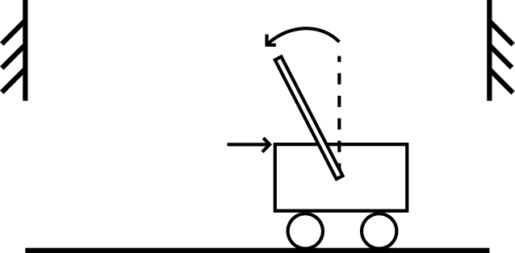

# mlopt-micp 
This repository contains code for [Learning Mixed-Integer Convex Optimization Strategies for Robot Planning and Control](asl.stanford.edu/publications) by Abhishek Cauligi\*, Preston Culbertson\*, Bartolomeo Stellato, Dimitris Bertsimas, Mac Schwager, and Marco Pavone (\* denotes equal contribution).

## Installation ##
This repository uses Julia-1.2 for the construction of the optimization problems and PyTorch for training the neural network models. The necessary Python packages can be installed by running the following script.
```
pip3 install -r requirements.txt
```
We also use the [Gurobi](https://github.com/JuliaOpt/Gurobi.jl) and [Mosek](https://github.com/JuliaOpt/Mosek.jl) commercial solvers for solving our training dataset offline (found in `{system}/data_collection.ipynb`).

## Useage ##
This repo contains examples for three systems in robot planning and control:
1. Free-flyer motion planning
<p align="center"></p>

2. Cart-pole with contact
<p align="center"></p>

3. Dexterous grasping
<p align="center"></p>

The MICP for each problem is defined in `{system}/problem.jl` using either the [JuMP](https://github.com/JuliaOpt/JuMP.jl) or [Convex](https://github.com/JuliaOpt/Convex.jl) modeling framework. The `{system}/data_collection.ipynb` notebook must be run first to generate the MICP datasets later used in training.

Each system has a `{system}.ipynb` notebook that steps through the strategy construction, classifier training, and evaluation of the trained strategy predictions. The neural network models are trained separately using Python scripts found in the `pytorch` directory and the strategy and network parameters are saved in the `models` directory.


## Quick Start ##
An example notebook can be run through:
```
jupyter notebook cartpole.ipynb 
```
